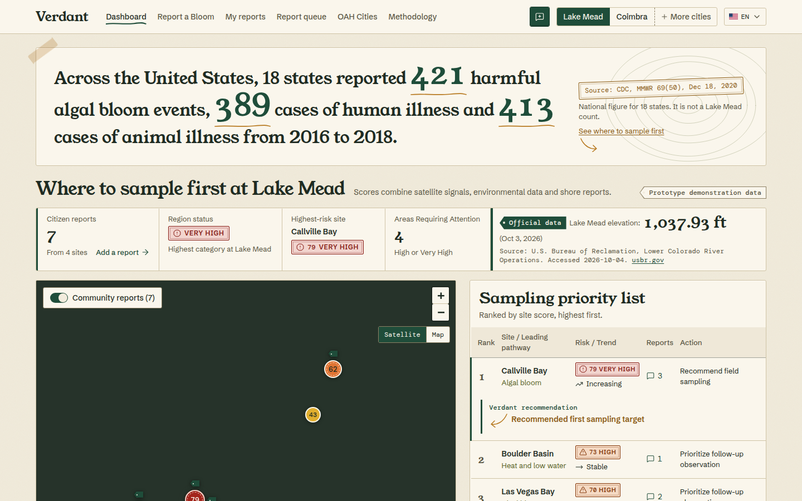
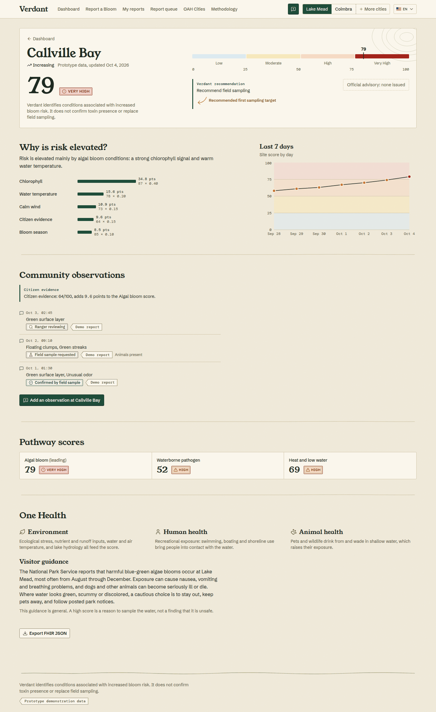
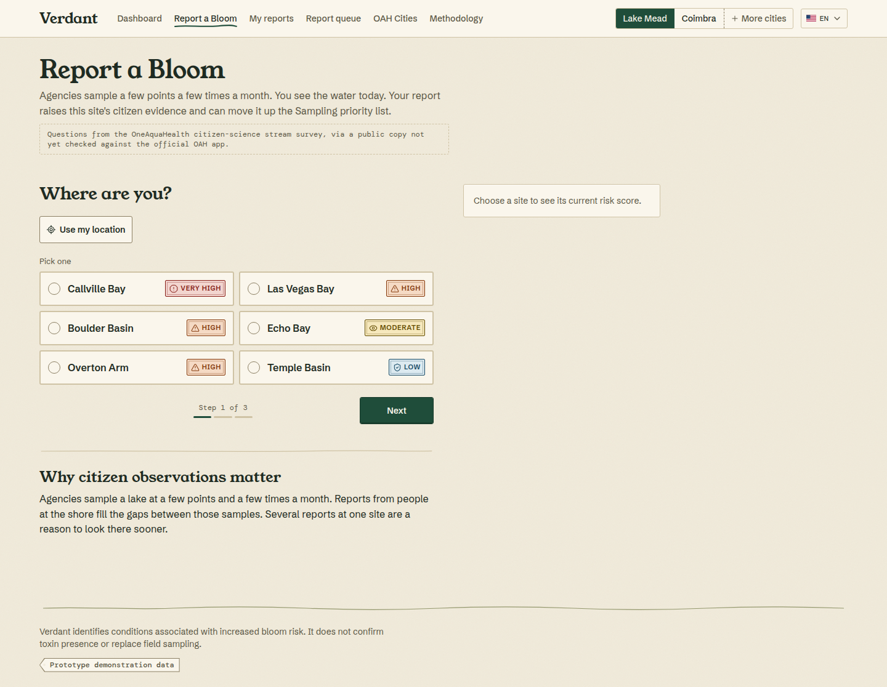
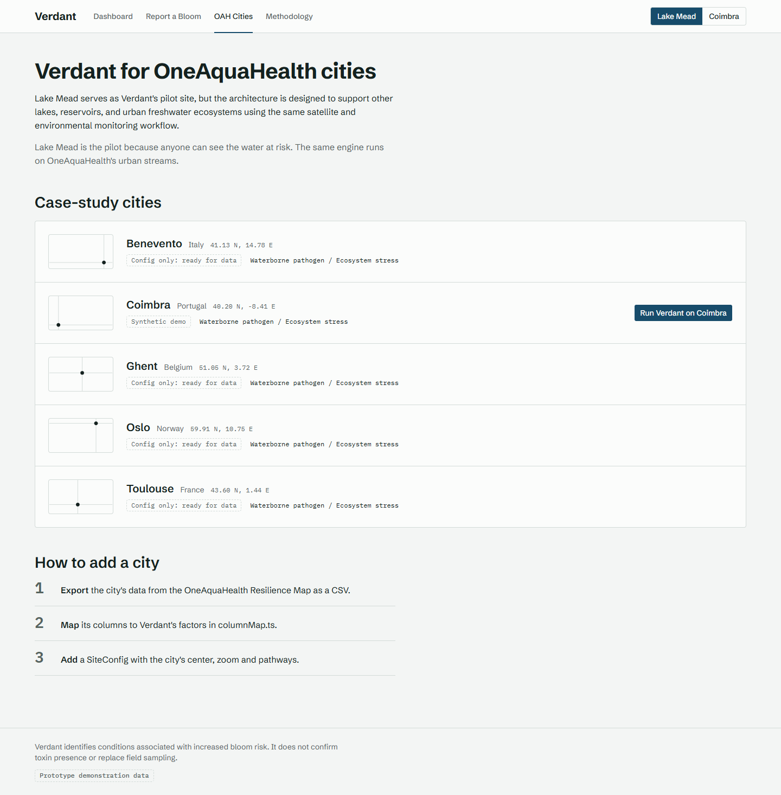
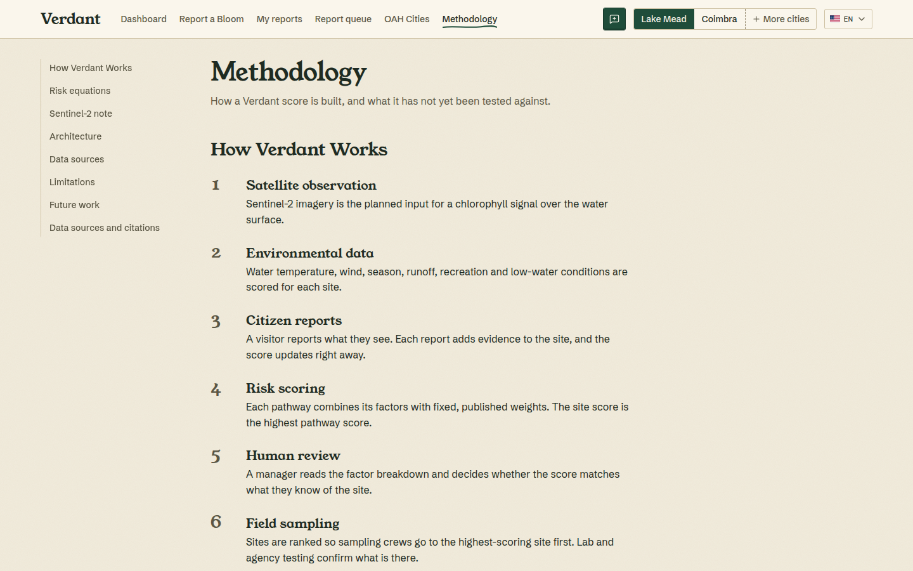
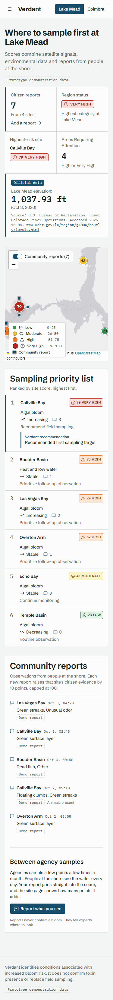
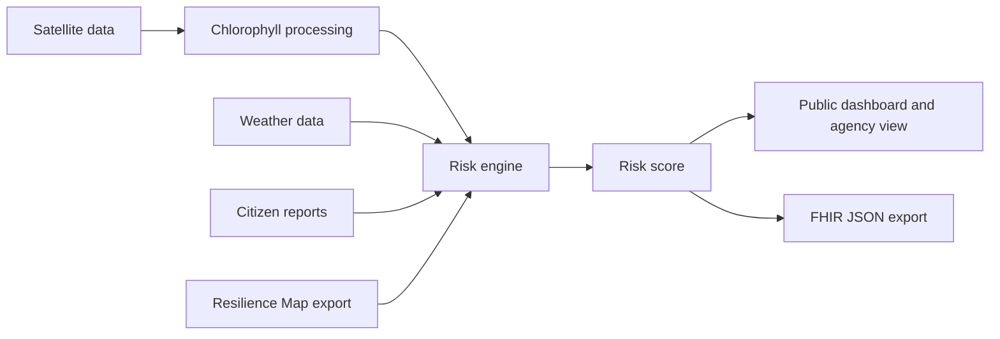

# Verdant

**See the bloom before it becomes a warning.**

Verdant is an explainable early-warning prototype for freshwater One Health risk. It combines satellite-derived, environmental and citizen-reported signals into a risk score for each monitoring site, and it tells a manager which site to sample first. Lake Mead is the pilot. The same engine runs on a OneAquaHealth city through one site configuration.

Built for the OneAquaHealth IEEE Global Hackathon 2026, Track 6.

- Live demo: (added at deploy)
- Demo video: (added after recording)

### Screenshots













## 2. Problem and solution

Monitoring cannot continuously cover every part of a lake or an urban stream network. Harmful algal blooms are a real exposure for people and animals. Across the United States, 18 states reported 421 harmful algal bloom events, 389 cases of human illness and 413 cases of animal illness during 2016–2018 (CDC, MMWR 69(50); this is a national figure, and no Lake Mead-specific count was found). At Lake Mead, the National Park Service says blooms occur there, that toxins can make people sick and can seriously sicken or kill dogs and other animals, and that blooms are most common from August through December.

Verdant combines satellite, environmental and citizen observations into an explainable, multi-hazard risk score. Each score names the hazard pathway that drives it, shows how much each factor contributes, and ends in a recommended next step. Experts see where follow-up monitoring is needed first. Verdant supports human decisions. It does not diagnose or confirm toxic blooms.

## 3. Track 6 alignment

Track 6 is Resilience Informatics: "Enable early warning & resilience planning". Verdant turns scattered environmental and citizen signals into early warning and monitoring priorities for freshwater sites. The Sampling priority list ranks sites by score, and the top row is tagged as the recommended first sampling target.

## 4. Risk model

Each site is scored on one or more hazard pathways. A pathway is a set of factors with fixed, published weights that sum to 1.00. Every factor is a 0 to 100 score.

| Pathway | Factors and weights | Used by |
|---|---|---|
| `algal_bloom` | chlorophyll 0.40, water_temperature 0.20, calm_wind 0.15, citizen_evidence 0.15, seasonality 0.10 | Lake Mead |
| `waterborne_pathogen` | runoff 0.35, water_temperature 0.15, citizen_evidence 0.20, recreation_exposure 0.30 | Lake Mead |
| `heat_low_water` | air_temperature 0.40, low_water 0.40, citizen_evidence 0.20 | Lake Mead |
| `waterborne_pathogen_oah` | lab_pathogen_risk 0.40, runoff 0.25, air_temperature 0.15, citizen_evidence 0.20 | OAH cities |
| `ecosystem_stress` | contamination 0.40, ecosystem_health_deficit 0.40, citizen_evidence 0.20 | OAH cities |

**Equation.** The pathway score is `round(sum(weight × value) / sum(weight))`, summed over the factors that are present. Each factor's contribution is `weight × value / coverage`, so the contributions add up to the unrounded score. The site score is the highest pathway score, and the pathway that sets it is the leading pathway. A tie goes to the earlier pathway in the site's configuration.

**Categories.**

| Score | Category | Recommendation |
|---|---|---|
| 0–25 | Low | Routine observation |
| 26–50 | Moderate | Continue monitoring |
| 51–75 | High | Prioritize follow-up observation |
| 76–100 | Very High | Recommend field sampling |

**Coverage rule.** Coverage is the sum of the weights of the factors that have a value. When a factor is missing, the score is computed from the present factors and rescaled by coverage. When coverage is below 1, the interface shows "Partial data: X% of factors".

**Trend.** The last value of the 7-day history minus the first: +5 or more is Increasing, −5 or less is Decreasing, anything else is Stable.

A citizen report raises a site's `citizen_evidence` factor by 10, capped at 100, and the score updates on screen.

## 5. Data

- **Lake Mead: prototype data.** Six sites (Callville Bay, Las Vegas Bay, Boulder Basin, Echo Bay, Overton Arm, Temple Basin) carry Verdant's own factor scores, a 7-day score history and seven seed citizen reports tagged `synthetic-demo`. These are not measurements. Every screen that shows them is labelled "Prototype demonstration data".
- **Lake Mead: one official data element.** The Dashboard shows the U.S. Bureau of Reclamation Lake Mead elevation, 1,037.93 ft on 2026-10-03, as a fixed snapshot with an "Official data" badge and a source link. The app does not fetch it live. It sits beside the prototype values and is never labelled as prototype.
- **Coimbra: real satellite summary, synthetic site scores.** Coimbra is the OneAquaHealth city used to show transferability. The one export available from the Resilience Map (https://apps.oneaquahealth.eu/resmap/) is an area-level Earth-observation summary: monthly NDVI and NDWI for Coimbra as a whole, 2020-01 to 2026-09 (citation C9). Verdant charts the last 24 months with values on the OAH Cities page and on the Coimbra Dashboard. The export has no per-site, pathogen, contamination or ecosystem columns, so the 20 Coimbra sites (C1 to C20, named after the Resilience Map sites) carry synthetic factor values at approximate positions. They are labelled "Synthetic demo, structured as a Resilience Map export" and are not measurements. The PapaParse-based parser for per-site exports stays in place and is tested on a fixture.
- **Benevento, Ghent, Oslo and Toulouse** are config-only: a map center, zoom and pathways, with no sites yet.

## 6. Methodology

How Verdant Works: satellite observation, then environmental data, then citizen reports, then risk scoring, then human review, then field sampling.

NDCI note: NDCI = (B5 − B4) / (B5 + B4), with B4 red and B5 red-edge, is an experimental chlorophyll proxy, not toxin detection. Verdant shows it as the planned satellite input; the prototype uses labelled demonstration values.

The Methodology page in the app also lists the risk equations, the architecture diagram, data-source cards, limitations and future work.

## 7. Architecture

Satellite data goes through chlorophyll processing into the risk engine. Weather data, citizen reports and the Resilience Map export feed the same engine. The engine produces a risk score, which is shown on the public dashboard and agency view and can be exported as FHIR-shaped JSON. In the prototype the satellite and weather inputs are labelled demonstration values, and there is no backend.



## 8. FHIR export

The Site detail page has an "Export FHIR JSON" button. It downloads `verdant-<config.id>-fhir.json`, a FHIR-shaped `Bundle` of type `collection`:

- One `Location` per site, with `meta.profile` = `${OAH_IG_BASE}/StructureDefinition/location-oah`, plus name and position.
- One `Observation` per site score: status `preliminary`, code text "Verdant site risk score", an integer value, one component per pathway, and the category as interpretation.
- One `Observation` per citizen report, with `meta.profile` = `${OAH_IG_BASE}/StructureDefinition/observation-indicators-oah`, category text "citizen-science", the observation types, date and notes.
- Every resource carries a `meta.tag` of `prototype` (Lake Mead) or `synthetic-demo`.

`OAH_IG_BASE` is `http://hl7.eu/fhir/ig/oah`, defined once in `src/fhir/constants.ts`. It was read from the implementation guide's `sushi-config.yaml` on 2026-10-04 (citation C6).

**The profile ids `location-oah` and `observation-indicators-oah` are unverified.** The implementation guide's CI build returned 404 on 2026-10-04, so the profile pages could not be checked. The export is FHIR-shaped. It has not been validated against the guide, and it is not submitted to any FHIR server.

## 9. Tech stack and running it

React, TypeScript, Vite, Tailwind CSS and shadcn components, Leaflet with react-leaflet, Recharts, react-router, PapaParse, and Vitest. There is no backend or database.

```
npm install
npm run dev        # start the dev server
npx vitest run     # run the tests (risk engine, FHIR bundle, CSV parser)
npm run build      # production build
```

## 10. Limitations

All Verdant scores are unvalidated. The weights are fixed and published, but no score has yet been compared with field measurements.

- Lake Mead scores come from prototype factor values, not live satellite or weather data.
- A citizen report does not confirm a harmful algal bloom. Laboratory or agency testing is required for confirmation.
- The report form's observation types are placeholders marked to be replaced with the OneAquaHealth protocol fields (citation C8). The official protocol fields could not be retrieved.
- The FHIR profile ids are unverified (see section 8).
- Reports and score changes live in the browser session. Nothing is stored.

## 11. Future work

1. Validation: compare Verdant scores with in-situ field-sample results (chlorophyll-a and cyanotoxin measurements from agency sampling) at the same sites and dates.
2. Real-time Sentinel-2 ingestion.
3. Live weather APIs.
4. Agency monitoring integration.
5. Validated local risk models.
6. Mobile citizen reporting.
7. Automated alerts.
8. FHIR server submission.

## 12. Disclaimer

Verdant identifies conditions associated with increased bloom risk. It does not confirm toxin presence or replace field sampling.

## 13. Data sources and citations

Verdant's own prototype factor scores are not citations. They are labelled "Prototype demonstration data" wherever they appear.

| item | value or claim | source | publisher | URL | accessed date |
|---|---|---|---|---|---|
| C1 Opening statistic (video 0:00–0:25) | Across the United States, 18 states reported 421 harmful algal bloom events, 389 cases of human illness and 413 cases of animal illness during 2016–2018 (national figure; no Lake Mead-specific count was found) | Roberts et al., "Surveillance for Harmful Algal Bloom Events and Associated Human and Animal Illnesses — One Health Harmful Algal Bloom System, United States, 2016–2018", MMWR 69(50), published 2020-12-18 | U.S. Centers for Disease Control and Prevention | https://www.cdc.gov/mmwr/volumes/69/wr/mm6950a2.htm | 2026-10-04 |
| C2 Lake Mead bloom risk (video 0:00–0:25, One Health panel) | Harmful blue-green algae blooms occur at Lake Mead NRA; exposure symptoms include nausea, vomiting and breathing problems; dogs and other animals can become seriously ill or die from HAB toxins; blooms are most common from August through December | "Harmful Blue-Green Algae Blooms (HABs) - Lake Mead National Recreation Area", page last updated 2026-05-14 | U.S. National Park Service | https://www.nps.gov/lake/planyourvisit/harmful-blue-green-algae-blooms-habs.htm | 2026-10-04 |
| C3 Official Lake Mead data element (dashboard card) | Lake Mead elevation 1,037.93 ft on 2026-10-03 (daily operations report) | "Lower Colorado River Operations" | U.S. Bureau of Reclamation, Lower Colorado Region | https://www.usbr.gov/lc/region/g4000/hourly/levels.html | 2026-10-04 |
| C4 NDCI reference (Methodology NDCI note) | NDCI is a normalized difference of red-edge and red reflectance for estimating chlorophyll-a in turbid productive waters | Mishra, S. and Mishra, D. R., "Normalized difference chlorophyll index: A novel model for remote estimation of chlorophyll-a concentration in turbid productive waters", Remote Sensing of Environment 117: 394–406 (2012) | Elsevier | https://doi.org/10.1016/j.rse.2011.10.016 | 2026-10-04 |
| C5 Sentinel-2 bands (Methodology NDCI note) | Sentinel-2 MSI band B4 (red, central wavelength 664.6 nm on Sentinel-2A, 10 m) and band B5 (vegetation red edge, 704.1 nm on Sentinel-2A, 20 m) | "S2 Mission", SentiWiki | European Space Agency / Copernicus | https://sentiwiki.copernicus.eu/web/s2-mission | 2026-10-04 |
| C6 OAH FHIR IG (FHIR export, A5) | IG "OneAquaHealth Project", id `hl7.eu.fhir.oah`, canonical `http://hl7.eu/fhir/ig/oah`, version 0.1.0-ci-build | `sushi-config.yaml` in the `hl7-eu/oah` repository | HL7 Europe / OneAquaHealth Project | https://github.com/hl7-eu/oah | 2026-10-04 |
| C7 OAH Resilience Map (Coimbra data, OAH-cities page) | Source of the Coimbra CSV export (A3) | "Resilience Map" web application | OneAquaHealth Project (served from the oneaquahealth.eu domain; the page names no publisher) | https://apps.oneaquahealth.eu/resmap/ | 2026-10-04 |
| C8 OAH citizen-science / field protocol (report form, A4) | Harmonized OneAquaHealth procedures for sampling-site characterization and ecosystem-health and biological indicators | Calapez, A. R. et al., "OneAquaHealth Field Sampling Protocols for Urban Stream Ecosystems", 2026-05-22, DOI 10.5281/zenodo.20344421 | Zenodo (OneAquaHealth, Horizon Europe) | https://zenodo.org/records/20344421 | 2026-10-04 |
| C9 Coimbra Earth-observation summary (satellite signal chart) | Monthly NDVI and NDWI area means for Coimbra, 2020-01 to 2026-09 | Resilience Map, Earth-observation area summary export (file eo_summary_area_Coimbra_1969-01-01_to_2026-10-03.csv) | OneAquaHealth Project (served from the oneaquahealth.eu domain) | https://apps.oneaquahealth.eu/resmap/ | 2026-10-04 |
| C10 Citizen-science stream questions (report form, Task 20.7) | Seven citizen-science questions (foam, riparian vegetation, filamentous algae, hydrology, diptera, ticks, wildlife) as used in a OneAquaHealth citizen-science form; reproduced in a public hackathon repository and not verified against the official OAH app | `codes.js` in the AquaLink repository | GitHub user Sravya1802 (public repository) | https://github.com/Sravya1802/aqualink | 2026-10-04 |
